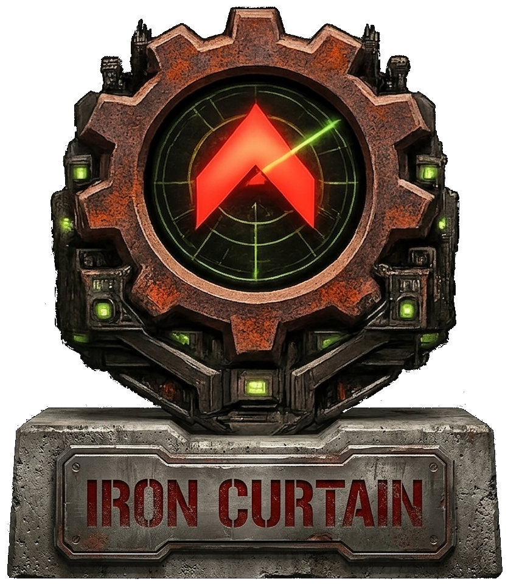

# Iron Curtain

<p align="center">
  
</p>

<p align="center">
  <a href="https://github.com/iron-curtain-engine/iron-curtain/actions/workflows/ci.yml"></a>
  <a href="https://github.com/iron-curtain-engine/iron-curtain/actions/workflows/audit.yml"></a>
  <a href="LICENSE"></a>
</p>

<p align="center">
  <a href="https://www.rust-lang.org"></a>
  &nbsp;&nbsp;
  <br>
  
  &nbsp;
  
</p>

A modern open-source RTS engine in Rust, starting with Command & Conquer.

*Red Alert first. Tiberian Dawn alongside it. The rest of the C&C family follows later.*

## Status

Iron Curtain is in early development.

- Active milestone: `M1`
- Active focus: `G2` windowed render bootstrap on top of completed `G1.1`-`G1.3`
  content-pipeline foundations
- Current workspace crates: `ic-protocol`, `ic-cnc-content`, `ic-render`, `ic-game`
- A runnable bootstrap client exists, but no playable game build exists yet

## Design And Local Rules

Canonical architecture, roadmap, and design rationale live in the
[Iron Curtain design-doc repository](https://github.com/iron-curtain-engine/iron-curtain-design-docs).
The hosted book is:

**<https://iron-curtain-engine.github.io/iron-curtain-design-docs/>**

For local implementation work in this repo, read:

- `AGENTS.md` for coding-session rules and architectural invariants
- `CODE-INDEX.md` for current-file routing and repo navigation

## Repo Family

Iron Curtain is one repository in the wider `iron-curtain-engine` family.
Sibling repos currently include:

| Repository | Role |
| --- | --- |
| [`iron-curtain-design-docs`](https://github.com/iron-curtain-engine/iron-curtain-design-docs) | Canonical architecture, roadmap, and design decisions |
| [`cnc-formats`](https://github.com/iron-curtain-engine/cnc-formats) | Clean-room C&C binary format parsers and conversion tooling |
| [`fixed-game-math`](https://github.com/iron-curtain-engine/fixed-game-math) | Deterministic fixed-point math crate |
| [`deterministic-rng`](https://github.com/iron-curtain-engine/deterministic-rng) | Platform-identical deterministic random number generator |

## Building

```bash
cargo build --workspace
cargo fmt --all --check
cargo test --workspace --locked
cargo clippy --workspace --all-targets --locked -- -D warnings
```

You can also run the repo-local CI wrapper:

```bash
./ci-local.sh
```

Or on PowerShell:

```powershell
./ci-local.ps1
```

The local CI wrappers aim to stay aligned with the GitHub Actions flow.
GitHub Actions is the authoritative enforcement path for documentation, MSRV,
license, and security-audit checks; the local scripts run those checks when the
required tools are available on the machine.

## First Visible Slice

The repo now includes a narrow runnable client bootstrap:

```bash
cargo run -p ic-game --locked
```

Today this opens a Bevy window and draws one synthetic RA-style sprite built
through the current `ic-cnc-content` and `ic-render` pipeline. It is a proof of
the content-to-render handoff, not a full map loader or gameplay loop yet.

## Current Crates

| Crate | Purpose |
| --- | --- |
| `ic-protocol` | Shared wire types for the future simulation/network boundary |
| `ic-cnc-content` | Iron Curtain-side Bevy integration for legacy C&C content loading |
| `ic-render` | Render-side camera bootstrap and static-scene validation for the future RA viewport |
| `ic-game` | Runnable Bevy client bootstrap that opens a window and displays the first RA-style demo sprite |

Additional crates from the full architecture will be added as local
implementation reaches later milestones.

## Standalone Crates (MIT/Apache-2.0)

These general-purpose libraries live in separate repositories under permissive
licenses for reuse outside the engine (D076):

| Crate | Repository | Purpose |
| --- | --- | --- |
| `cnc-formats` | [cnc-formats](https://github.com/iron-curtain-engine/cnc-formats) | Clean-room C&C binary format parsers |
| `fixed-game-math` | [fixed-game-math](https://github.com/iron-curtain-engine/fixed-game-math) | Deterministic fixed-point arithmetic |
| `deterministic-rng` | [deterministic-rng](https://github.com/iron-curtain-engine/deterministic-rng) | Seedable platform-identical PRNG |

## Contributing

Read [CONTRIBUTING.md](CONTRIBUTING.md) before opening a PR.

All contributions require a Developer Certificate of Origin (DCO). Add
`Signed-off-by` to your commits with `git commit -s`.

## License

Engine source code is licensed under **GPL-3.0-or-later** with the project’s
modding exception. YAML, Lua, and WASM mods loaded through the engine’s data
interfaces are not treated as derivative works.

See [LICENSE](LICENSE) for the full text.

## Trademark Disclaimer

Red Alert, Tiberian Dawn, Command & Conquer, and C&C are trademarks of
Electronic Arts Inc. Iron Curtain is not affiliated with, endorsed by, or
sponsored by Electronic Arts. These names are used only to identify the games
and formats the engine is intended to interoperate with.
